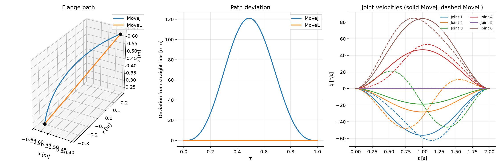

# UR5 Trajectories — MoveJ vs MoveL

How a robot gets from one pose to another, and what it costs. The same start and goal
pose, interpolated once in **joint space** (MoveJ) and once in **Cartesian space** (MoveL),
compared on path shape, joint velocities, computational cost and behaviour near a
singularity.



*Left: flange path in space. Middle: deviation from the straight line. Right: joint
velocities, solid = MoveJ, dashed = MoveL.*

---

## The question

Every industrial robot controller offers both motion types, and the manual explains what
they do but not what they cost. MoveJ interpolates each joint angle independently from
start to goal. MoveL forces the tool centre point onto a straight line and solves the
inverse kinematics at every step. Both reach the same goal. The differences show up
everywhere else.

**Test case** — UR5 (DH model from `roboticstoolbox`), identical for every script:

```
q0 = [ 20, -60,  80, -110, -90,  30] deg
q1 = [-40, -90,  60,  -60, -90, 120] deg
T  = 2.0 s, 100 samples
```

Both motions use the **same quintic time law**, so the only variable is the space in
which the interpolation happens. Comparing `jtraj` against a default `ctraj` would change
path shape and timing at once and prove nothing.

## Results

| | MoveJ (joint space) | MoveL (Cartesian) |
|---|---|---|
| Flange path length | 740.9 mm | 684.1 mm |
| Deviation from the straight line | 121 mm (8.3 % detour) | straight by construction |
| Joint distance travelled | 250.0° (= net distance) | 278.7° (+11.5 %) |
| Peak joint velocity (joint 3) | 18.7 °/s | 46.3 °/s (2.5x) |
| Computation time | 0.04 ms | 81.5 ms (1918x) |

> **MoveJ is the shortest path in joint space, MoveL the shortest in the workspace.
> Each is wasteful when measured in the other's units** — an 8.3 % detour through space
> against 11.5 % of extra joint travel.

MoveJ is the normal case, not the fallback: shortest cycle time, lowest peak velocities,
no singularity problem. MoveL is for the part of the motion where the *path itself* is
the task — the last centimetres onto the workpiece, a weld seam, a dispensing line. The
choice is made per motion, not per program.

## Findings

**Geometry and timing are decoupled.** The 121 mm bulge depends only on the path
parameter, not on the travel time. Practical consequence: *if a MoveJ path hits
something, moving slower does not help.* Only a via point does.

**Why MoveL demands more speed.** Individual joints overshoot their goal and come back —
joint 3 travels 40.2° to cover a net 20°. That extra back-and-forth has to fit into the
same two seconds, so the peak velocity rises even though the path through space is
shorter.

**Quintic vs trapezoidal timing.** The quintic profile s(t) = 10t³ − 15t⁴ + 6t⁵ follows
from six boundary conditions (position, velocity and acceleration zero at both ends).
Its peaks are qd = 1.875·dq/T, qdd = 5.774·dq/T², jerk = 60·dq/T³. A trapezoidal profile
at the same T gives 1.5·dq/T and 4.5·dq/T² — a **25 % shorter cycle time at the same
joint limit**, paid for with infinite jerk. Real controllers compromise with an S-curve.

**Diagnosing a singularity inside a derivative.** What identifies a divergence is not the
number but its behaviour under grid refinement. The quintic jerk converges with O(h²)
towards 675 °/s³. The trapezoidal jerk grows proportionally with the sample count
(1879 → 7575 → 30356) and never converges — that is what "infinite" means numerically.

**The wrist singularity is the sharpest result.** At q5 = 0 axes 4 and 6 align and the
inverse Jacobian scales with 1/sin(q5). A MoveL straight through it demands
**2384 °/s — 13.2 times the joint limit.** The sign is the proof that this is genuine
kinematics and not a solver artefact: qd4 = −2384 °/s against qd6 = +1950 °/s, two
enormous opposing motions whose small difference is the entire useful effect.
Manipulability collapses from 0.047 to 0.0014 at the same point.

**MoveJ never notices.** It does not invert the Jacobian, so no singularity exists for
it. Same two poses: MoveJ uses 26 % of the joint limit, MoveL 1320 %. Anyone who must
pass through anyway uses the damped pseudoinverse J† = Jᵀ(JJᵀ + λ²I)⁻¹ and pays with
path accuracy — not implemented here.

## Running it

Requires **Python 3.12** — `roboticstoolbox-python` has no wheels for 3.13/3.14 yet, and
the system `python3` on macOS may well be newer.

```bash
python3.12 -m venv .venv
source .venv/bin/activate
pip install -r requirements.txt
python vergleich.py
```

Every script is standalone, takes no arguments and prints its results to the terminal.
The test case sits in the first lines of each file — change `q0`, `q1` or `T` there.

Most scripts print to the terminal and exit. Four of them draw and need a display:
`plot.py` (regenerates `movej_vs_movel.png`, then shows it), `animate.py` (plays a full
cycle: MoveJ outbound, MoveL back), `fk.py` and `workspace.py`.

## Files

**Kinematics** — the groundwork the trajectories build on:

| File | Content |
|---|---|
| `transforms.py` | Homogeneous transforms, rotation and translation |
| `dh.py` | Denavit-Hartenberg parameters of the UR5 |
| `fk.py` | Forward kinematics |
| `ik.py`, `ik_alle.py` | Inverse kinematics, single solution and all branches |
| `jacobi.py` | Jacobian |
| `manip.py` | Manipulability as a distance measure to singularities |
| `singular.py` | Where the UR5 loses a degree of freedom |
| `workspace.py` | Reachable workspace |

**Trajectories:**

| File | Content |
|---|---|
| `traj.py` | Joint-space path, quintic profile |
| `bahnform.py` | What the flange does during a MoveJ — deviation measured |
| `bahn_linear.py` | Cartesian path, per-point IK seeded with the previous solution |
| `vergleich.py` | The direct comparison, including timing |
| `profile.py` | Quintic vs trapezoidal, jerk under grid refinement |
| `singular_bahn.py` | MoveL through the wrist singularity at q5 = 0 |
| `plot.py`, `animate.py` | The result figure and the animation |

## Pitfalls found on the way

Four mistakes that produce plausible-looking but wrong numbers — all of them made here
first:

- **`rtb.jtraj(q0, q1, n)` with an integer** silently builds a time axis of 0…n
  *seconds*. Every velocity then comes out in the wrong unit. Always pass a time vector,
  `np.linspace(0, T, n)`.
- **`ctraj` uses a trapezoidal profile of its own** unless told otherwise. Pass
  `s=rtb.quintic(0, 1, t).s` explicitly, or the comparison mixes two path shapes with two
  time laws.
- **MoveL has no closed form for the joint velocities**, so they come from
  `np.gradient(q, t, axis=0)`. Omitting the `t` yields degrees *per sample* instead of
  degrees per second — a factor of 50 that looks entirely reasonable.
- **Count `sol.success` along the IK chain.** Without it, a velocity spike cannot be told
  apart from an inverse kinematics that simply failed to converge.

## Scope

Pure kinematics — no dynamics, no torques, no motor model. Joint velocities are compared
against the nominal UR5 limit of 180 °/s, nothing more. The robot is the DH model shipped
with `roboticstoolbox`, not a calibrated machine. The numbers above belong to this one
pose pair; the ordering behind them does not.
